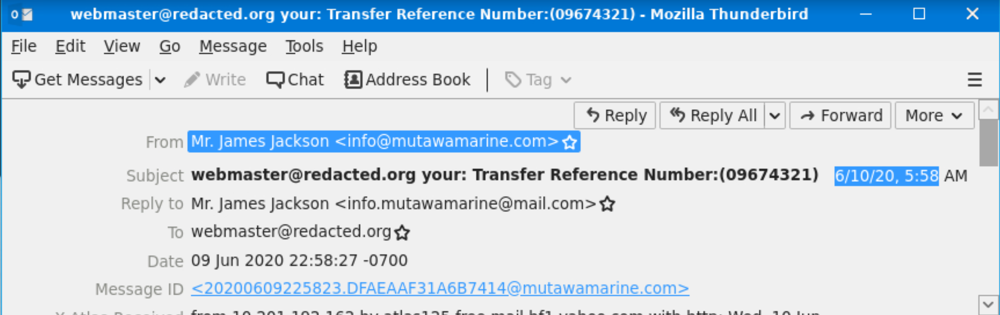
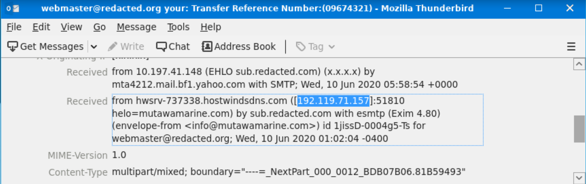
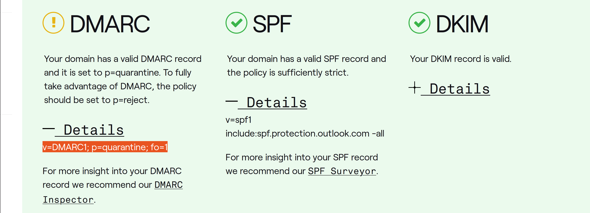
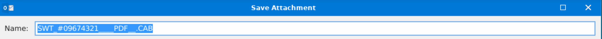
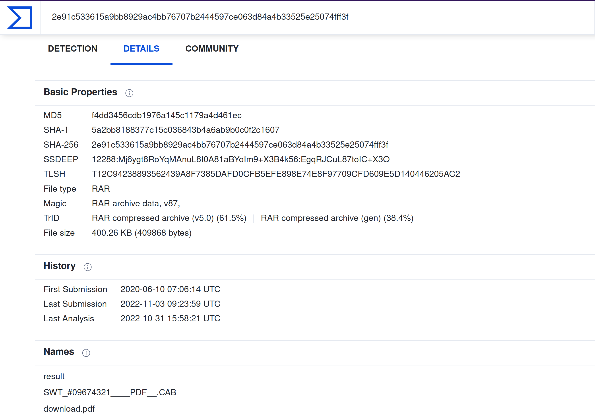

|                                   |
|:-----------------------------------------------------------------------------:|
| [THM: The Greenholt Phish](https://tryhackme.com/room/phishingemails5fgjlzxc) |

# The Greenholt phish

A Sales Executive at Greenholt PLC received an email that he didn't expect to receive from a customer. He claims 
that the customer never uses generic greetings such as "Good day" and didn't expect any amount of money to be 
transferred to his account. The email also contains an attachment that he never requested. He forwarded the email 
to the SOC (Security Operations Center) department for further investigation.

Investigate the email sample to determine if it is legitimate.

## Questions

**What is the email's timestamp? (answer format: mm/dd/yyyy hh:mm)**, **Who is the email from?**, 
**What is his email address?**, and **What email address will receive a reply to this email?**

Looking at the headers in thunderbird:

|                                                      |
|:-------------------------------------------------------------------------------------------------:|
| `06/10/2020 5:58`, `Mr. James Jackson`, `info@mutawamarine.com`, and `info.mutawamarine@mail.com` |

**What is the Originating IP?**

|  |
|:---------------------------------------------:|
|               `NOT the answer`                |

|    |
|:-----------------------------------------------:|
|                `192.119.71.157`                 |

**Who is the owner of the Originating IP? (Do not include the "." in your answer.)**

I used [domaintools whois](https://whois.domaintools.com/192.119.71.157)

|   |
|:----------------------------------------------:|
|                `Hostwinds Llc`                 |

**What is the SPF record for the Return-Path domain?** and **What is the DMARC record for the Return-Path domain?**

I used [demarcian domain checker](https://dmarcian.com/domain-checker/):

|                                         |
|:------------------------------------------------------------------------------------:|
| `v=spf1 include:spf.protection.outlook.com -all`   `v=DMARC1; p=quarantine; fo=1` |

**What is the name of the attachment?**

|   |
|:----------------------------------------------:|
|         `vSWT_#09674321____PDF__.CAB`          |

**What is the SHA256 hash of the file attachment?**

    sha256sum SWT_#09674321____PDF__.CAB
    2e91c533615a9bb8929ac4bb76707b2444597ce063d84a4b33525e25074fff3f  SWT_#09674321____PDF__.CAB

**What is the attachments file size? (Don't forget to add "KB" to your answer, NUM KB)** and **What is the actual file extension of the attachment?**

I used [VirusTotal](https://www.virustotal.com/gui/file/2e91c533615a9bb8929ac4bb76707b2444597ce063d84a4b33525e25074fff3f/details):

|  |
|:---------------------------------------------:|
|            `400.26 KB` resp `RAR`             |
